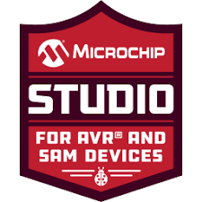

<!-- Header -->
<p align="center">
  
</p>

<p align="center">
  <a href="https://isaacadjei.me">
    
  </a>
  <a href="https://www.linkedin.com/in/isaacadjei">
    
  </a>
  <a href="mailto:eng@isaacadjei.me">
    
  </a>
  
</p>

<p align="center">
  
</p>

---

<p align="center">
  🔎 <b>Quick navigation:</b>
  <a href="#overview">Overview</a> •
  <a href="#hardware">Hardware</a> •
  <a href="#getting-started">Getting Started</a> •
  <a href="#projects">Projects</a> •
  <a href="#state-machine-modes">State Machine</a> •
  <a href="#documentation-hub">Docs</a> •
  <a href="#acknowledgements">Acknowledgements</a>
</p>

---

<a id="overview"></a>

## Overview

A personal project to learn bare metal AVR C development, writing directly to hardware registers without any framework or abstraction layer. The ATmega644P runs at 20 MHz on a [custom PCB designed by Richard Reeves](hardware/pcb_notes.md) with an external crystal, LM317T voltage regulator and 10-way headers breaking out all 32 I/O pins.

Projects progress from a basic LED blink through GPIO manipulation, button polling, interrupt-driven input, software PWM and ADC, building towards a full nine-mode state machine that includes a reaction game and a Tetris melody synced to LEDs. All code targets the ATmega644P and can be built with either [PlatformIO in VS Code](WORKFLOW.md) or Microchip Studio 7. See [WORKFLOW.md](WORKFLOW.md) for the full setup and flash guide.

<a id="tech-stack"></a>

<div align="center">

|  |  |  |  |  |  |  |
| :-: | :-: | :-: | :-: | :-: | :-: | :-: |
| **C** | **Embedded C** | **PlatformIO** | **VS Code** | **Microchip Studio** | **Git** | **GitHub** |

</div>

---

<a id="hardware"></a>

## Hardware

| Item       | Detail                                                    |
| ---------- | --------------------------------------------------------- |
| MCU        | ATmega644P DIP-40, 20 MHz external crystal                |
| PCB        | Richard Reeves AVR Project PCB 2019 with LM317T regulator |
| Programmer | Pololu USB AVR Programmer v2.1 via STK500v2 on COM4       |

The breadboard components (LEDs, button, buzzer) are a **temporary configuration** used for learning and change between sessions. See [docs/wiring.md](docs/wiring.md) for the current breadboard connections and header pin assignments. Full PCB component list, connector pinout and power supply circuit are in [hardware/pcb_notes.md](hardware/pcb_notes.md).

---

<a id="getting-started"></a>

## Getting Started

1. Clone the repo and choose an IDE: VS Code with PlatformIO or Microchip Studio 7.
2. Follow the full setup guide in [WORKFLOW.md](WORKFLOW.md). It covers prerequisites, environment switching, build tasks and flash commands.
3. Connect the Pololu programmer to the ISP header (J1) on the PCB and to a USB port (COM4).
4. Select a project from the [Projects](#projects) table below and build.

Manual flash command if needed:

```
C:\avrdude\avrdude.exe -c stk500v2 -p m644p -P COM4 -B 10 -V -U flash:w:<project>.hex:i
```

The `-B 10` flag slows the ISP clock to ~50 kHz, which is required to avoid timeout errors with the Pololu programmer. See [WORKFLOW.md](WORKFLOW.md) for the full flag reference and troubleshooting steps.

---

<a id="projects"></a>

## Projects

| # | File | Description | Key Concepts |
| - | ---- | ----------- | ------------ |
| 0 | [00_fuse_test.c](projects/learning_projects/00_fuse_test/00_fuse_test.c) | Fuse configuration and restoration reference | Fuse bits, clock source, avrdude `-F` flag |
| 1 | [01_blink.c](projects/learning_projects/01_blink/01_blink.c) | Double blink on PB0 | `DDRB`, `PORTB`, `_delay_ms` |
| 2 | [02_led_cycle.c](projects/learning_projects/02_led_cycle/02_led_cycle.c) | Five LEDs cycling sequentially | Multi-pin output, bit shifting |
| 3 | [03_button_polling.c](projects/learning_projects/03_button_polling/03_button_polling.c) | Button drives buzzer via polling | `PIND`, input reading, active buzzer |
| 4 | [04_interrupt_buzzer.c](projects/learning_projects/04_interrupt_buzzer/04_interrupt_buzzer.c) | Button drives buzzer via INT0 | ISR, `EICRA`, `EIMSK`, `sei()` |
| 5 | [05_state_machine_basic.c](projects/learning_projects/05_state_machine_basic/05_state_machine_basic.c) | Four-mode state machine (initial build) | `enum`, ISR, debounce, `switch` |
| 6 | [06_state_machine.c](projects/learning_projects/06_state_machine/06_state_machine.c) | Nine-mode state machine (full build) | PWM, ADC, reaction game, Tetris melody |

Source files live in [`projects/learning_projects/`](projects/learning_projects/) (one folder per project). The active project is also copied into [`platformio/src/`](platformio/src/) for building. See [WORKFLOW.md](WORKFLOW.md) for how to switch between projects.

---

<a id="state-machine-modes"></a>

## State Machine Modes

[`06_state_machine.c`](projects/learning_projects/06_state_machine/06_state_machine.c) cycles through nine modes on each button press. Mode state is held in a `volatile` variable updated inside an INT0 ISR with software debounce.

| Mode | Name           | Description                                      |
| ---- | -------------- | ------------------------------------------------ |
| 0    | Chase          | LEDs light one by one in sequence                |
| 1    | Blink All      | All five LEDs blink together                     |
| 2    | Alternate      | Odd and even LEDs alternate                      |
| 3    | PWM Fade       | All LEDs fade in and out via software PWM        |
| 4    | Knight Rider   | Single LED sweeps left to right and back         |
| 5    | Binary Counter | LEDs count 0 to 31 in binary                     |
| 6    | Random         | LEDs display random patterns seeded by ADC noise |
| 7    | Reaction Game  | Press button when green LED lights to win        |
| 8    | Tetris Melody  | Tetris theme plays with LEDs synced to each note |

---

<a id="documentation-hub"></a>

## Documentation Hub

| Document | Description |
| -------- | ----------- |
| [Build and Flash Workflow](WORKFLOW.md) | Full VS Code/PlatformIO and Microchip Studio setup, environment switching, build tasks and troubleshooting |
| [Wiring Reference](docs/wiring.md) | Current breadboard connections and header pin tables |
| [Hardware Notes](docs/hardware_notes.md) | Fuse settings, ISP clock speed, register map and ADC configuration |
| [PCB Full Reference](hardware/pcb_notes.md) | Component list, connector pinout, power supply circuit and soldering order |
| [PCB Schematic PDF](hardware/AVR_PCB_2019.pdf) | Original PCB schematic and layout PDF for the Richard Reeves AVR Project PCB 2019 |
| [ATmega644P Datasheet](hardware/ATmega644P_datasheet.pdf) | Official Microchip datasheet for the ATmega644P |
| [C Operators Reference PDF](docs/C_Operators.pdf) | Printable C operator reference card |

### Session Notes

Each session has a `notes.md` (reference) and a `lab.md` (hands-on tasks).

| Session | Topic | Notes | Lab |
| ------- | ----- | ----- | --- |
| 1 | Introduction to AVR C | [notes](notes/session_01/notes.md) | [lab](notes/session_01/lab.md) |
| 2 | Bit Shifting, Arrays and Data Types | [notes](notes/session_02/notes.md) | [lab](notes/session_02/lab.md) |
| 3 | Inputs, Bit Masking and Interrupts | [notes](notes/session_03/notes.md) | [lab](notes/session_03/lab.md) |
| 4 | Timers: Overflow and Output Compare | [notes](notes/session_04/notes.md) | [lab](notes/session_04/lab.md) |
| 5 | Hardware PWM | [notes](notes/session_05/notes.md) | [lab](notes/session_05/lab.md) |
| 6 | UART Serial Transmission | [notes](notes/session_06/notes.md) | [lab](notes/session_06/lab.md) |
| 7 | Analogue to Digital Conversion | [notes](notes/session_07/notes.md) | [lab](notes/session_07/lab.md) |
| 8 | UART Serial Reception | [notes](notes/session_08/notes.md) | [lab](notes/session_08/lab.md) |

### General Reference

| Document | Description |
| -------- | ----------- |
| [C Operators Reference](notes/general/c_operators.md) | Arithmetic, bitwise, relational and assignment operator tables with AVR examples and precedence table |
| [Hardware Reference](notes/general/hardware.md) | PCB overview, power supply, headers (J1 to J7), crystal, fuse summary and component list |

---

---

<a id="acknowledgements"></a>

## Acknowledgements

**Richard Reeves**, lab technician at Aston University, designed the AVR Project PCB and provided components and guidance.

---

## Contact and Support

Open an [issue](https://github.com/zaccessss/avr-zac/issues) in this repository for questions or bugs.

You can also reach me directly at [eng@isaacadjei.me](mailto:eng@isaacadjei.me) or via my [website contact page](https://isaacadjei.me/contact).

<p align="center">
  
</p>
